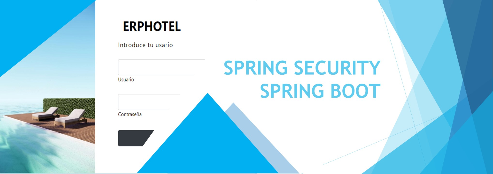

# Hello, my name is Adam Sanchez 👋
### Backend developer

I'm a backend developer with experience in a variety of programming languages, including Java, C#, Kotlin. My passion for technology and coding has led me to acquire skills in multiple platforms and development tools.

In my work, I enjoy solving complex problems and designing scalable and efficient solutions. Additionally, I am committed to continuous learning and am always looking for ways to improve my skills and stay up to date with the latest industry trends and technologies.

In this GitHub profile, you can find some of my projects and contributions to different open source projects. I hope you can find something that interests you and that you can collaborate with me on any project you want.

## Technologies:

 

 

 

 

## Certificates:

## Find me on:

## Created Projects:

### HOTELERP

### Zenhabit APP

